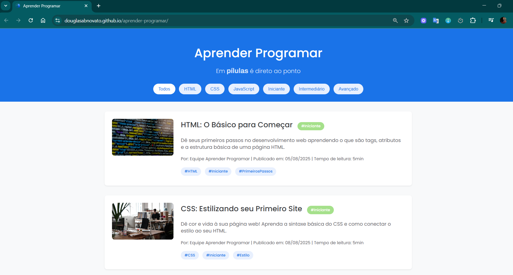

# Projeto: pílulas - é direto ao ponto

Este projeto é um blog minimalista e moderno, focado em oferecer conteúdo de programação de forma concisa e direta, ideal para desenvolvedores que buscam aprendizado rápido e eficiente.

---

## Características

-   **Design Minimalista e Moderno**: Estética limpa, inspirada no Material Design do Google, com foco na legibilidade e na experiência do usuário.
-   **Layout de Cards**: Cada artigo é exibido em um `card` expansível, facilitando a navegação e a organização do conteúdo.
-   **Identidade Visual**: Uso de tipografia distinta para o nome do blog (**Poppins** e **Archivo**), reforçando a marca.
-   **Responsividade**: O layout é totalmente adaptável a qualquer dispositivo, desde celulares até desktops.
-   **Estrutura Completa**: O site conta com `header`, barra de filtro, área de conteúdo e um `footer` informativo.

## Funcionalidades

-   **Expansão de Cards**: Artigos podem ser expandidos e recolhidos com um clique ou pressionando `Enter`/`Espaço`, exibindo o conteúdo completo.
-   **Filtragem de Conteúdo**: Botões de filtro permitem exibir artigos por tecnologia (**HTML**, **CSS**, **JavaScript**), facilitando a busca por temas específicos.
-   **Transições e Efeitos Visuais**: Animações suaves em elementos como os cards e os botões de filtro proporcionam uma experiência de usuário mais agradável.
-   **Interatividade no Rodapé**: A área do rodapé inclui links sociais e um convite para os leitores enviarem sugestões, incentivando a participação da comunidade.

## Tecnologias Utilizadas

-   **HTML5**: Utilizado para estruturar o conteúdo do site de forma semântica, com tags como `header`, `main`, `footer` e `article`.
-   **CSS3**: Responsável por toda a parte de estilização, incluindo layout com **Flexbox**, responsividade com **Media Queries**, animações e transições.
-   **JavaScript (ES6+)**: Adiciona interatividade à página, manipulando o **DOM** para expandir os cards, aplicar a lógica de filtragem e tratar eventos do usuário.

## Metodologias

-   **Mobile-First**: O desenvolvimento foi iniciado com o design e a funcionalidade para dispositivos móveis, para depois expandir para telas maiores.
-   **Organização Semântica**: O uso de tags HTML e de classes CSS (seguindo um padrão similar ao `BEM`) foi feito de maneira lógica e consistente para garantir um código limpo e fácil de manter.
-   **UX/UI Simples**: O foco principal é em uma navegação intuitiva e uma experiência de usuário sem distrações, priorizando o acesso rápido à informação.

---

## Evolução do projeto

### Requisitos dos artigos

Serão artigos com a estrutura de ensinar a fazer algo em 5 passos. Isso condiciona a estruturar algo em detalhes para concretizar algo em 5 etapas explicadas em ordem. Se cinco não for o suficiente, significa que deve dividir em dois artigos. Se cinco for demais, deve inserir mais detalhes na sua explicação ou o que deseja ensinar não precisa de um artigo.

Utilize textos, imagens, vídeos e trechos de código para demonstrar e exemplificar a sua explicação.

### Estrutura do projeto

-   [x] criar o header
-   [x] criar os artigos
-   [x] criar os filtros
-   [x] criar o footer
-   [x] hospedar

### Bibliotecas

Para desenvolver esse site precisaremos de imagens, vídeos e códigos.
Por isso, manteremos algumas referências listadas.

-   **Pexels**: [https://www.pexels.com/](https://www.pexels.com/)
-   **Unsplash**: [https://unsplash.com/](https://unsplash.com/)
-   **Pixabay**: [https://pixabay.com/](https://pixabay.com/)
-   **Videvo**: [https://www.videvo.net/](https://www.videvo.net/)

### Próximos requisitos

-   [ ] Paginação
-   [ ] Newsletter

@douglasabnovato
